# Zen GNOME Theme

A simple theme that brings the clean and elegant look of GNOME's Adwaita to Zen Browser.

<table>
  <tr>
    <td align="center">
      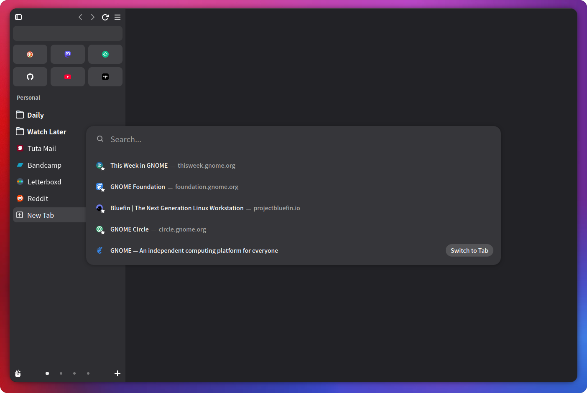
      <br>
      <sub>Dark mode</sub>
    </td>
    <td align="center">
      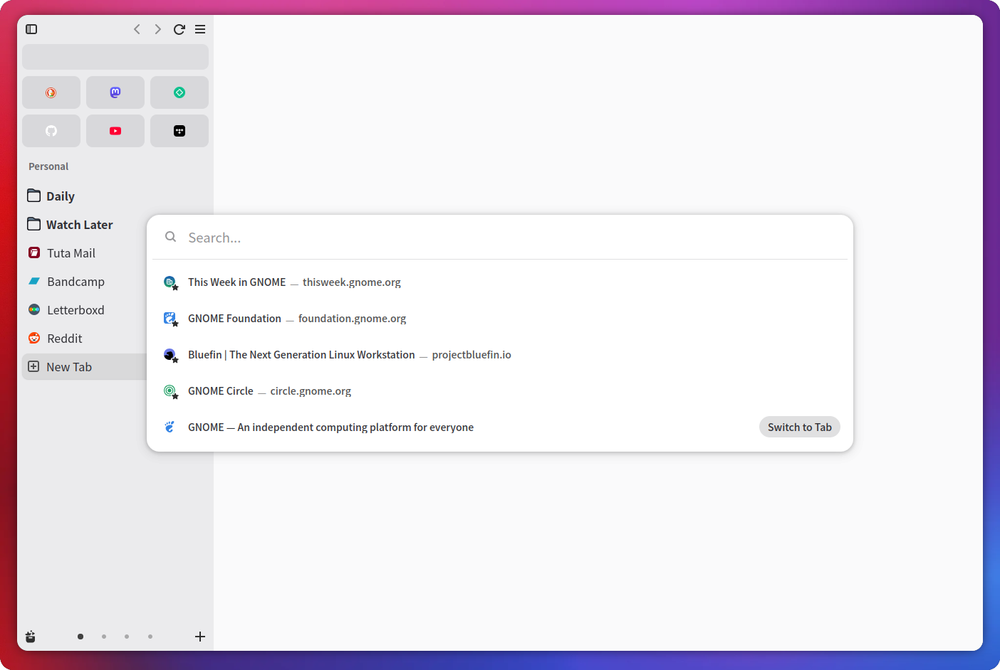
      <br>
      <sub>Light mode</sub>
    </td>
  </tr>
</table>

## ✨ Features

- **Omnibox:** Uses large, rounded corners inspired by GNOME. When focused, the URL is highlighted using the system accent color.

   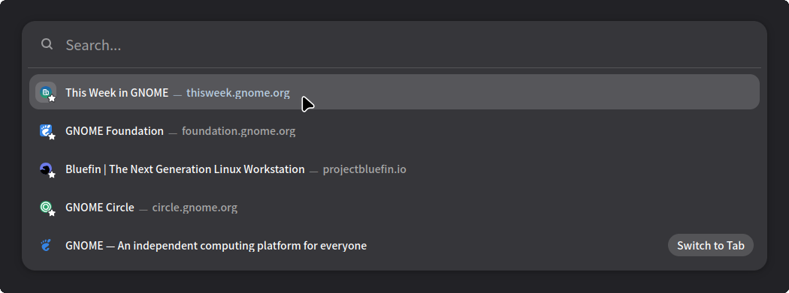

- **URL Bar:** Centers the URL and uses buttons inspired by Epiphany's design, making them easier to click.

   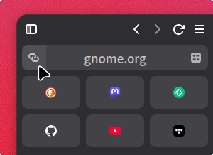

- **Sidebar:** Essentials are tinted based on their icon's overall color. The hamburger menu is moved to the right, while the Overflow button, when available, is moved to the left.

   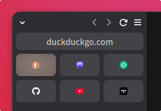
   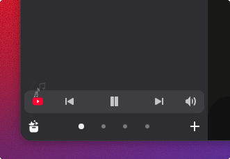

- **Context Menu:** Combines action buttons and removes unnecessary items, making it easier to find the action you need.

   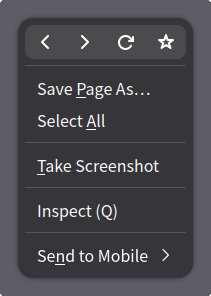
   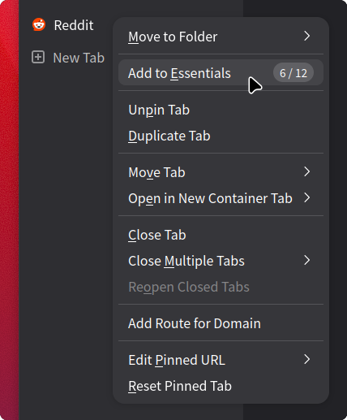

- **Library:** Workspace background colors follow Zen's built-in workspace settings, making it easier to tell workspaces apart.

   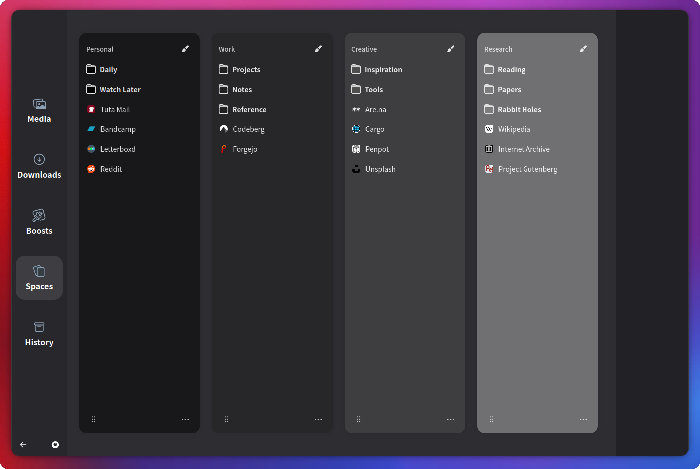

- **Dialog:** Adds polished, native-style windows and buttons.

   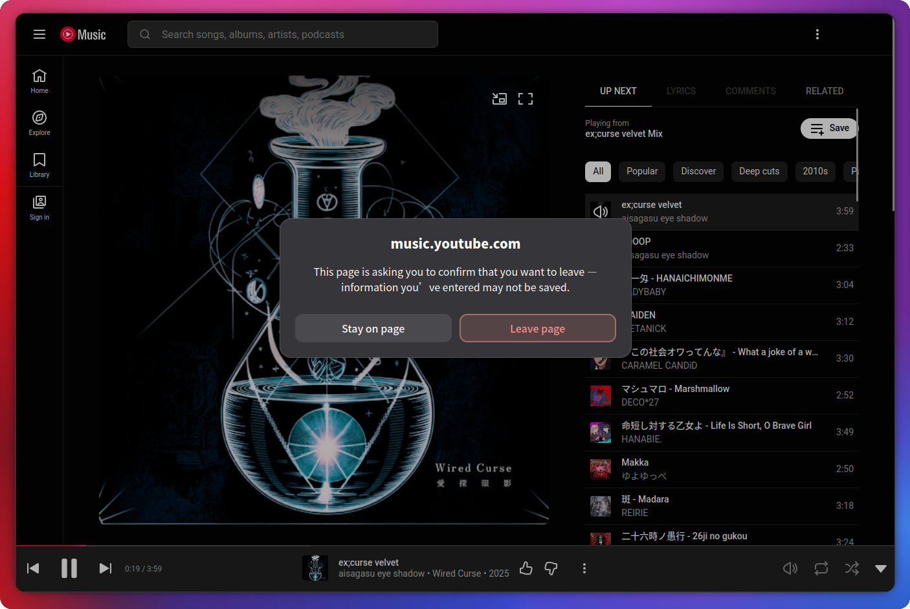

- **Icons:** Replaces the default icons with the Adwaita icon set and enhances the dimming effect when a window loses focus, making it easier to tell whether a window is active.

   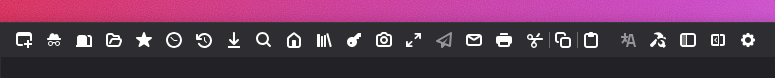

- **Interactions:** Hover, active, and other states are consistently indicated through changes in brightness. Many interactions also have subtle animations that stay out of the way.
- **Color Scheme:** The sidebar and window backgrounds use GNOME-inspired colors, with higher-contrast text and icon colors. The accent color follows the GNOME system setting.

## 📦 Installation

1. Make sure support for custom stylesheets is enabled in Zen Browser. See [here](https://github.com/ClixTW/zen-gnome-theme#-not-working) for instructions.
2. Download this repository.
3. Locate the `chrome` directory in your user profile.
4. Place the `userChrome.css` file and the `theme` folder inside the `chrome` directory.
5. Restart the browser.

## ✏️ Usage

1. Set `zen.theme.content-element-separation` to `0` on the `about:config` page. Some styles depend on this setting, so skipping this step may cause visual glitches.
2. Set Zen's built-in dark/light workspace modes to match your GNOME system setting. If your GNOME Shell is using dark mode, all Zen workspaces should also be set to dark mode, and vice versa. Otherwise, you may encounter dark backgrounds with dark icons, making them difficult to distinguish.

## ⚙️ Additional Options

This theme includes a few optional settings that you can enable if you prefer.

To change an option, simply open the `about:config` page, search for the corresponding preference, click the plus button on the right to add it, and leave its value set to `true`. To disable an option, change its value to `false`, or simply delete the preference.

- Disable color override: Useful if you prefer colorful windows and sidebars instead of gray/white-toned background colors.

    ```
    zen.gnome.theme.color-override.disabled
    ```
- Disable context menu cleanup: Useful if an item you frequently use has been removed and you want to restore the original menu items.

    ```
    zen.gnome.theme.context-menu-cleanup.disabled
    ```

## 😞 Known Limitations

- Light mode may have more visual issues. I don't use light mode myself, and debugging it is uncomfortable for my eyes (yes, even with my monitor brightness turned all the way down), so it has received less testing. If you encounter any issues, please open an issue. PRs are also welcome!

## ❓ Not Working?

- Make sure `userChrome.css` support is enabled in Zen Browser:

   1. Open the `about:config` page.
   2. Search for `toolkit.legacyUserProfileCustomizations.stylesheets` and toggle it to `true`.

- Make sure you placed the files in the correct user profile folder:

   1. Type `about:support` in the address bar and press Enter. 
   2. Look for the Application Basics section.
   3. Click on Open Profile Folder. This will open the folder where Zen Browser stores your user data.

> These steps are adapted from Zen's documentation: [Live Editing Zen Theme](https://docs.zen-browser.app/guides/live-editing)

## 💖 Acknowledgements

- firefox-gnome-theme: The strongest foundation for this project. Its styles, color variables, and icon-related tools saved me a great deal of time, and some elements were also inspired by its implementation.

## 📄 License

This project is open-source under the terms of the MIT License.
